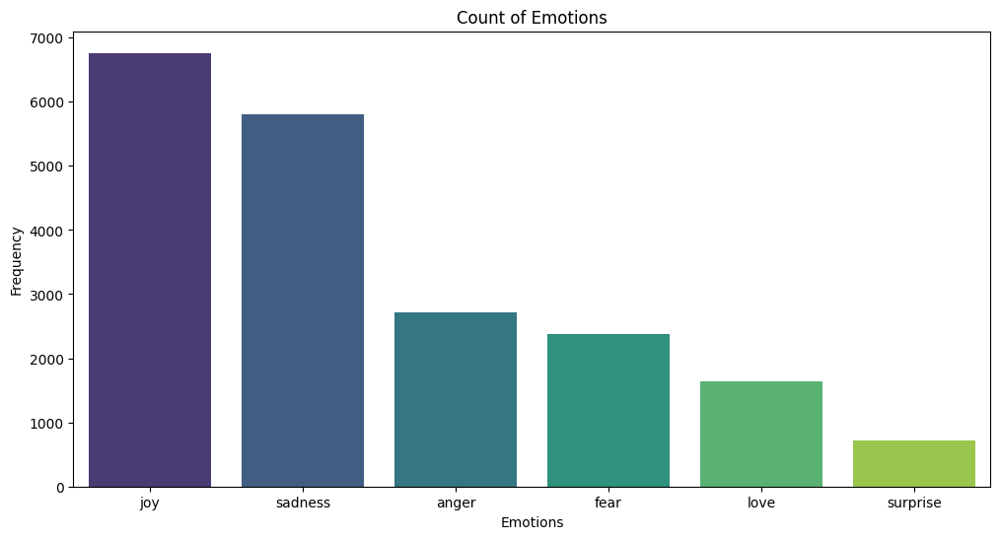

# Emotion Classification Based on Text Dataset
A small project for my submission of my learning in IDCamp 2023 about machine learning to classify text data. This project is about classifying text to several classes of emotion. To build the model, we will use Python with TensorFlow and Keras. I use Google Colab notebook to run my code, so I recommend to use Google Colab if you want to try my code.

The dataset that I used for this project is [this dataset](https://www.kaggle.com/datasets/praveengovi/emotions-dataset-for-nlp/data) from Kaggle. The size of dataset is 20,000. On the Kaggle site, the dataset is already divided into train, validation, and test. But, in this project, I merged the dataset again because I have specific criteria about my train-test data ratio which is about 80:20 ratio. So, you can use my dataset that I have uploaded in this repo or you can use the dataset directly from Kaggle. (But be advised, you may need additional fixing with the code if you use Kaggle dataset directly if you are going to use my notebook)

# Requirements
Library that I used for this project are below.
* TensorFlow
* Keras
* Matplotlib
* Numpy
* seaborn
* nltk
* wordcloud
* spacy
* re
* string
* unicodedata
* textblob
* sklearn

Note: In order to speed up your training process you will need to use the GPU since using CPU only will likely to take a long time.

# Project Structure
There are several steps in this project as stated below:
* Library Preparation
  
  In this step, we will prepare the necessary libraries and packages.
* Dataset Wrangling
  
  We download and read the dataset in this step. Then check any null values
* Text Preprocessing
  
  After we extract the dataset, next we will do text preprocessing such as text case lowering, convert emoticons, remove punctuation, remove stopwords, and words lemmatization.

* Exploratory Data Analysis

  Aside from text classification, we want to gain information on the dataset.
  
  1. Histogram of Text Length
     
     With histogram, we could get information about the distribution of text length. We also make statistics descriptive about our text.
     

  3. Wordcloud

     Wordcloud is a visualization that showing the most frequent words. We create wordcloud based on the every emotion classes.
     

  5. Emotion Counts
 
     With bar plot, we can visualize how many text in every emotion classes.
     
 

* Data Preparation

  Before we model and train the dataset, we need to prepare the dataset by tokenizing, encoding, create sequence, and splitting dataset.
* Classification Modelling
  
  The next step is building the classification model. We are going to use embedding layer for the input, 3 layers of LSTM, 1 dropout layer, 2 dense layer, and last is the output dense layer.
  

* Model Evaluation

  Model evaluation from the results of the training process is shown by creating accuracy plots and loss plots for training and validation.
  
* Model Testing

  Last, we should test our model with unseen data by using this function below. To test the model we can create a new text input. We create a function to preprocess the text that we inputted. Then we predict the processed inputted text with our model to determine its emotion.
  
  We input text = 'I feel sad' and below is the prediction results.
  

You may check my notebook for the detail of every steps.

# Conclusion
That was it, the Text Classification Project of Emotion Classification Based on Text. We achieved 91.4% accuracy, which is pretty high. We also succesfully create a test function to predict any text input. The model performance is quite good in classifying text on emotion, but it would be better to use another kind of data such as X (Twitter) text or any text data sources. Thank you for visiting my page if you have any further discussion or suggestion you may contact me! (A star would be very appreciated!)

